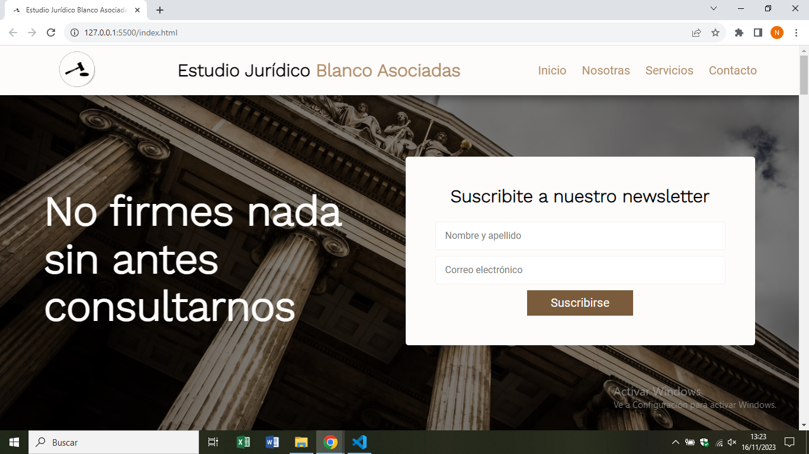
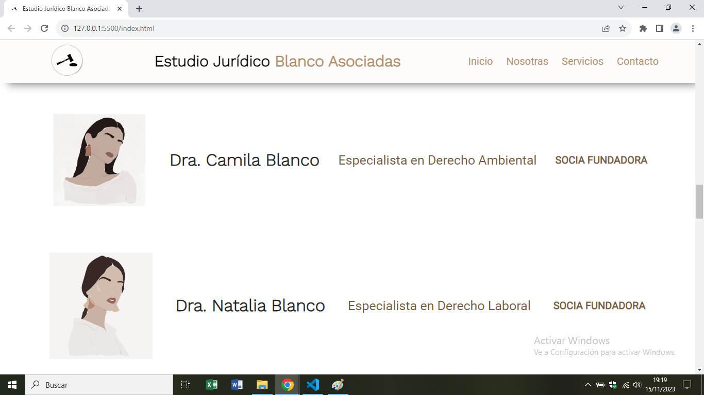
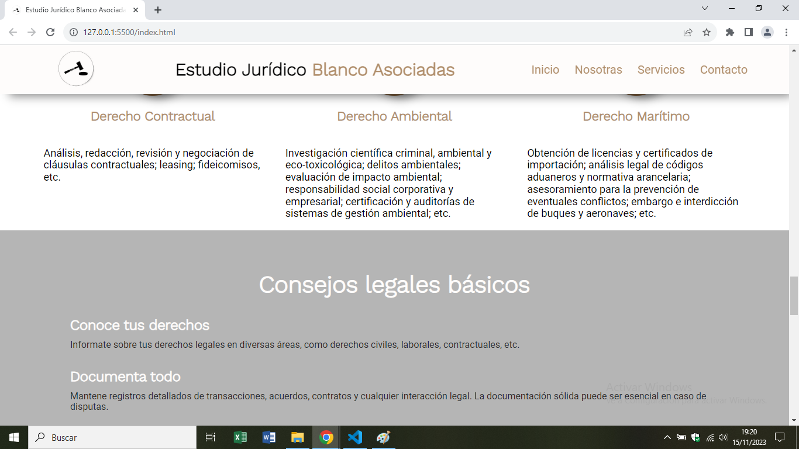
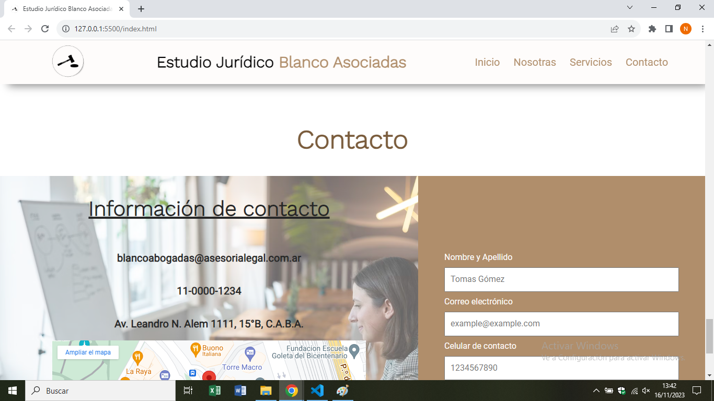
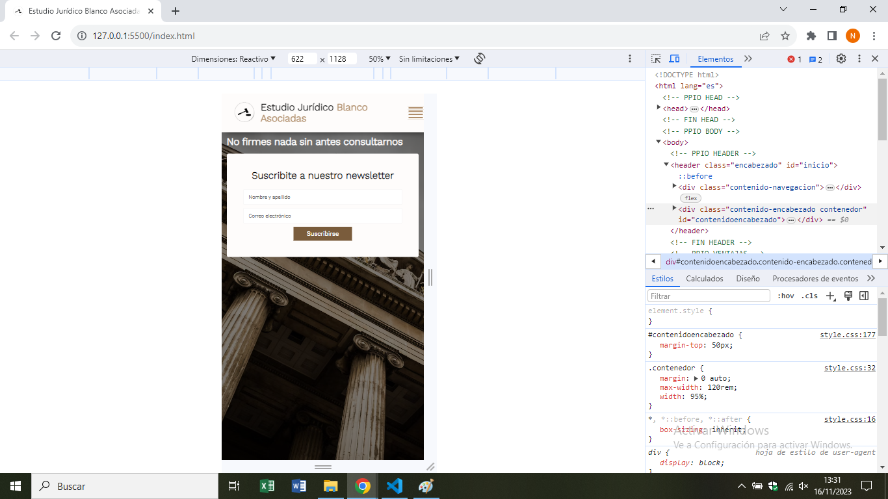
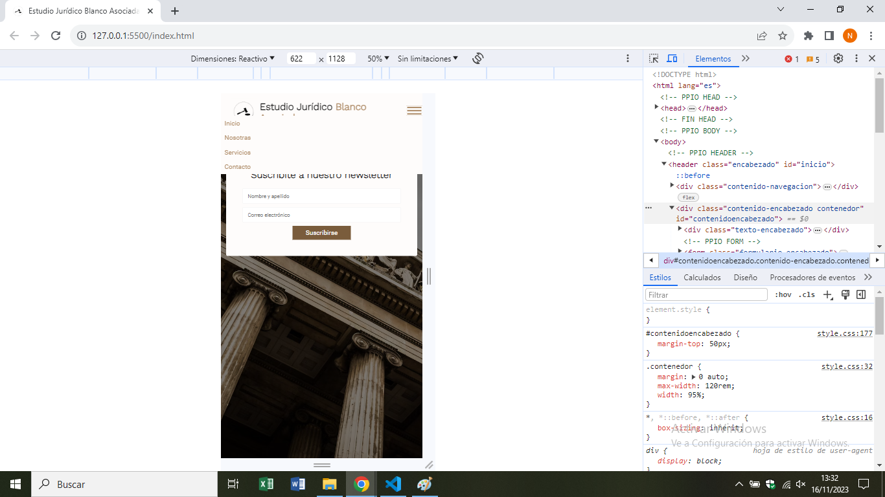
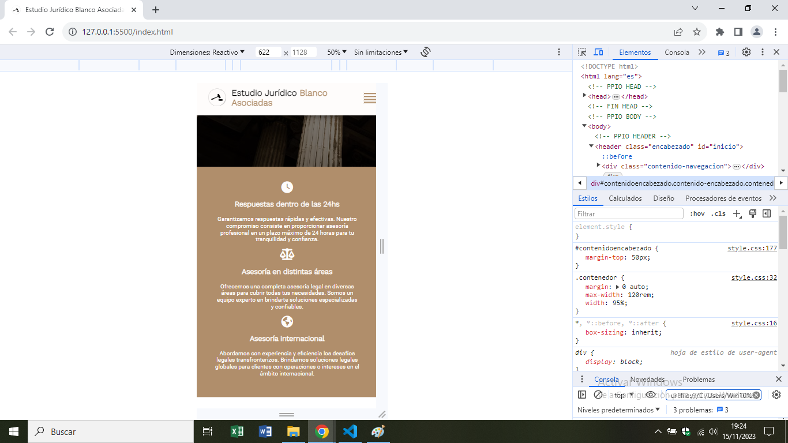
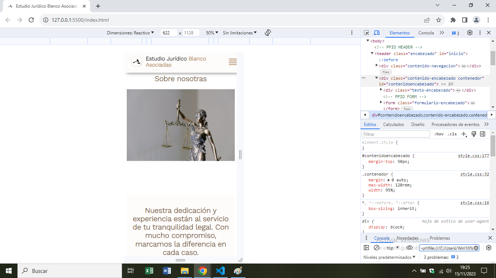
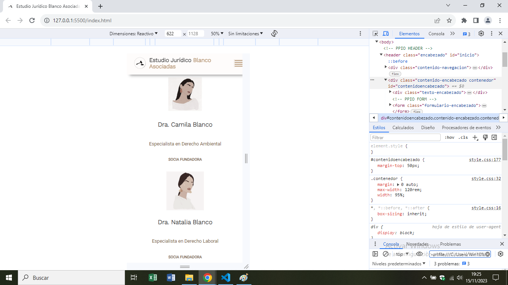
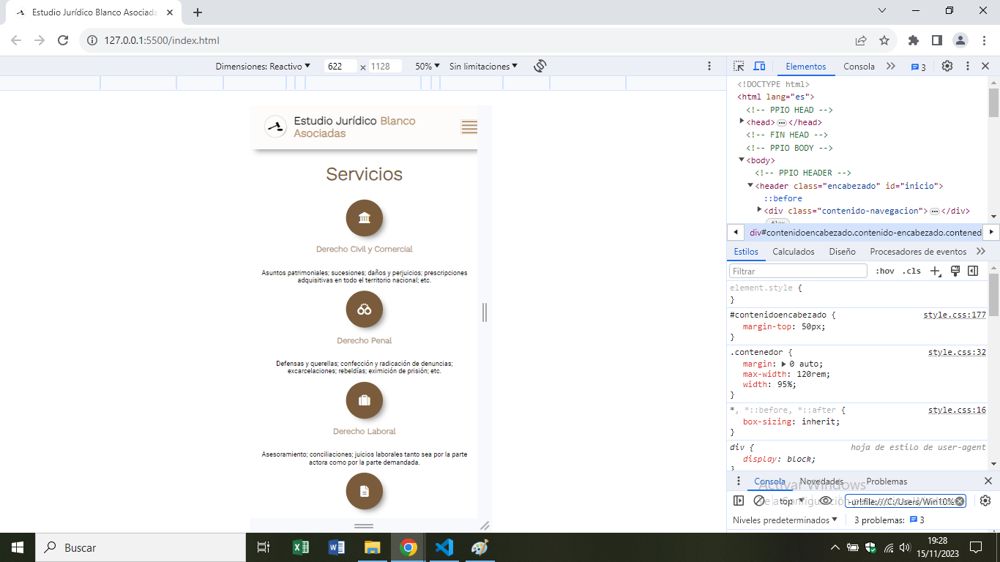

# Estudio Jurídico Blanco Asociadas
Este repositorio contiene el código fuente de la página web del Estudio Jurídico Blanco Asociadas.

## Descripción
La página web proporciona información sobre el estudio jurídico, sus servicios y el equipo de abogadas. Además, ofrece la posibilidad de agendar una cita y contactar con el estudio para consultas legales.

## Contenido del Repositorio
- **HTML**: El código HTML se encuentra en el archivo `index.html` e incluye la estructura básica de la página.
- **CSS**: El estilo de la página está definido en el archivo `style.css`, con estilos generales y específicos para cada sección.
- **JavaScript**: El comportamiento interactivo de la página está gestionado por el archivo `app.js`, que incluye funciones para mostrar/ocultar el menú de navegación y manejar eventos de clic.
- **Imágenes**: El directorio `img/` contiene las imágenes utilizadas en la página.

## Tecnologías Utilizadas
- **HTML5**: Estructura básica de la página.
- **CSS3**: Estilos para una apariencia atractiva y responsive.
- **JavaScript (ES6+)**: Interactividad y manipulación del DOM.
- **Font Awesome**: Iconos utilizados en la página.

## Equipo
El Estudio Jurídico Blanco Asociadas está conformado por profesionales dedicadas y con experiencia en diversas áreas del derecho. Conoce más sobre nuestro equipo en la sección [Nosotras](#nosotras) de la página.

## Contacto
- **Correo Electrónico:** blancoabogadas@asesorialegal.com.ar
- **Teléfono:** 11-0000-1234
- **Dirección:** Av. Leandro N. Alem 1111, 15°B, C.A.B.A.

## Redes Sociales
Buscanos en [YouTube](https://www.youtube.com) y [LinkedIn](https://www.linkedin.com) para obtener actualizaciones y contenido adicional.

## Derechos de Autor
&copy; Blanco Asociadas. Todos los derechos reservados.

## Capturas de pantalla de la pagina web

 
